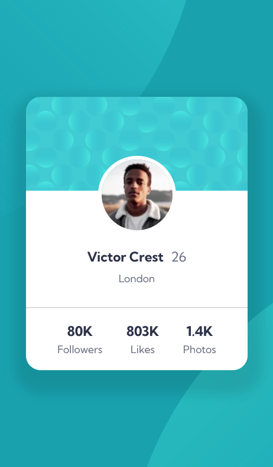
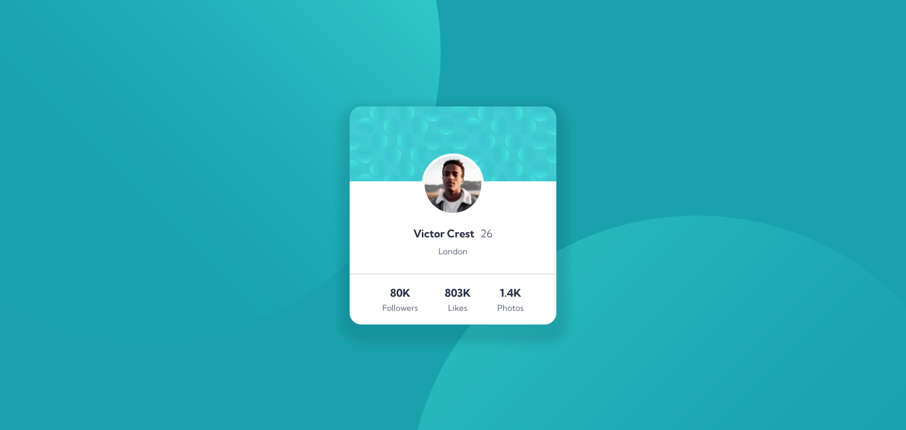

# Frontend Mentor - Profile card component


# Frontend Mentor - Profile card component solution

This is a solution to the [Profile card component challenge on Frontend Mentor](https://www.frontendmentor.io/challenges/profile-card-component-cfArpWshJ). Frontend Mentor challenges help you improve your coding skills by building realistic projects. 

## Table of contents

- [Overview](#overview)
  - [The challenge](#the-challenge)
  - [Screenshot](#screenshot)
  - [Links](#links)
- [My process](#my-process)
  - [Built with](#built-with)
  - [What I learned](#what-i-learned)
  - [Continued development](#continued-development)
  - [Useful resources](#useful-resources)
- [Author](#author)
- [Acknowledgments](#acknowledgments)


## Overview

### The challenge

- Build out the project to the designs provided

### Screenshot





### Links

- Solution URL: [Github](https://github.com/Nebil-Nej/profile-card-component-main)
- Live Site URL: [Netlify](https://magnificent-quokka-ea193c.netlify.app)

## My process

### Built with

- Semantic HTML5 markup
- CSS custom properties
- Flexbox


### What I learned

```css
.container{
  box-shadow: 0.1em 0.8em 0.8em 1em rgba(0, 0, 0, 0.1);
  }
  body {
    background-position: 70vw 60vh, 45vw 50vh;
  }
```

### Continued development

Need more work on CSS, box shadowing and background position especially.

### Useful resources

- [MDN](https://www.example.com) - Helped me with the Box-shadowing.
- [W3School](https://www.example.com) - Helped me with Background position of the image.

## Author

- Frontend Mentor - [@Nebil-Nej](https://www.frontendmentor.io/profile/Nebil-Nej)

## Acknowledgments

as i found the background position property hard to handle @palmettophoto on frontend mentor's code helped me get the idea for the background.
